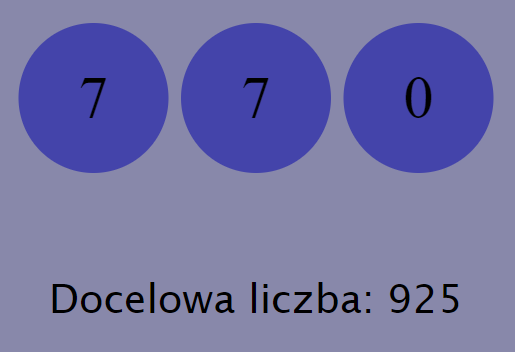

# Cogisum

## About
Cogisum is my original web logic game written in React and TypeScript.

## Rules
The player's goal is to reach the target score, which is different for each game. 
This can be done by clicking on the number-balls. 
Each value on each of the number-balls results in a different change in the actual value. 
The player must remember the changes to finish the game.

## How to run

<ul>
<li>Enter the system terminal.</li>
<li>Using the cd command, enter the address of the folder where the repository should be located.</li>
<li>Go back to GitHub, press the "Code" button and copy the address shown in the newly opened panel.</li>
<li>Type "git clone 'copied link'" in the terminal and press enter.</li>
<li>Type "cd cogisum".</li>
<li>Type "npm install" and then "npm run dev".</li>
<li>Copy the visible link starting with "http://localhost" and paste it into your browser.</li>
</ul>

## Enjoy!!!
